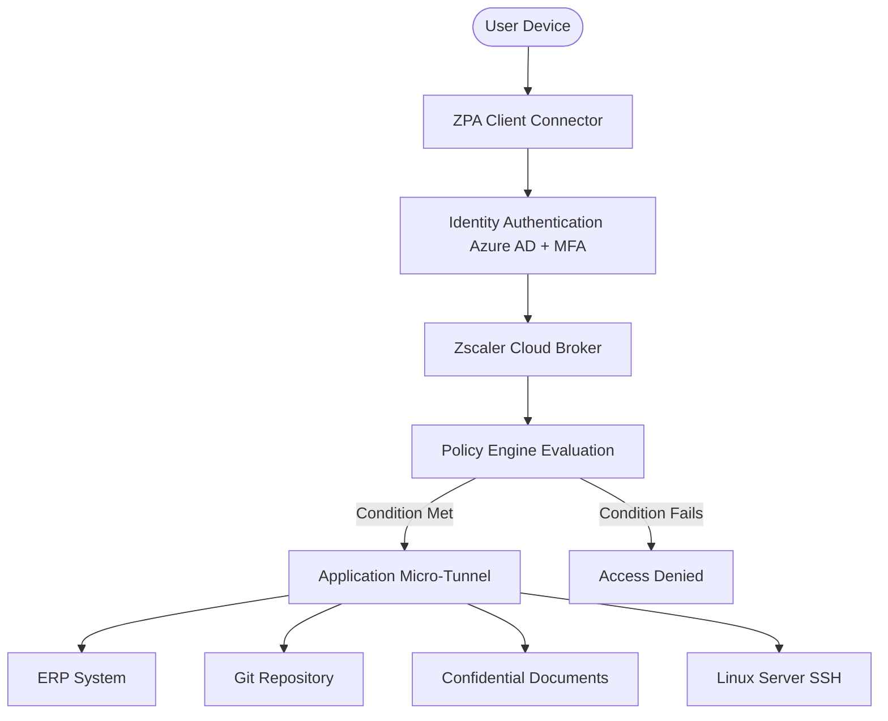

# Zero Trust Security Architecture Simulation (ZPA)

## Overview
This project is a Python-based simulation demonstrating a **Zero Trust Architecture (ZTA)** implemented conceptually as Zscaler Private Access (ZPA). It replaces traditional VPN network access with individual, isolated micro-tunnels granting users application-specific access.

The simulation evaluates dynamic contexts such as user identity (via mock Azure AD), device posture (MDM, Antivirus), temporal restrictions, and geographic location before granting access to resources. 

Additionally, it features a conceptual **Vulnerability Assessment Module** that emulates enterprise security scanners discovering web application vulnerabilities like Cross-Site Scripting (XSS) and SQL Injection.

## Features
- **Identity-based Access Control**: Validates users against organizational groups.
- **Micro-tunneling Simulation**: Grants access to a specific segment without exposing the broader network.
- **Context-Aware Engine**: Enforces device posture checking (e.g., Company device, MDM validated).
- **Vulnerability Scanner Mock**: Simulates the behavior of tools like Nessus or Burp Suite to identify vulnerabilities in target applications.

## Architecture

Below is the conceptual architecture flow implemented in this simulation:



## Setup & Running the Simulation

This program requires Python to execute. 

### Prerequisites
Make sure `python` or `py` (version 3.x) is installed on your system.
```bash
python --version
```

### Execution
Run the main script to start the simulation covering the 4 different Zero Trust scenarios and the Vulnerability Assessment demonstration.

```bash
python main_simulation.py
```

### Project Files
- `zpa_policy_engine.py`: Defines users, groups, application segments, and enforces access control rules based on trust context.
- `vulnerability_scanner.py`: Simulates scanning for web application vulnerabilities (like Stored XSS) and details mitigation strategies.
- `main_simulation.py`: Executes all connection scenarios as defined in the project scope (Finance, Contractor, Executive, Administrator use cases).
